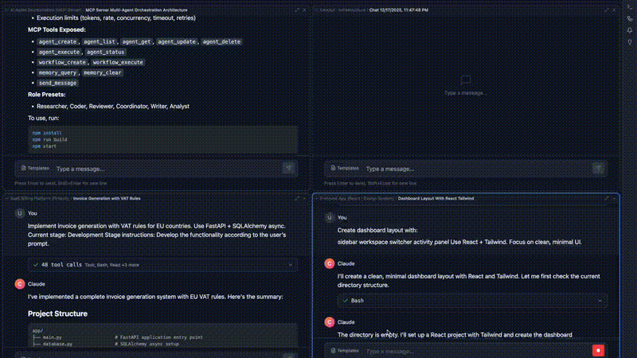
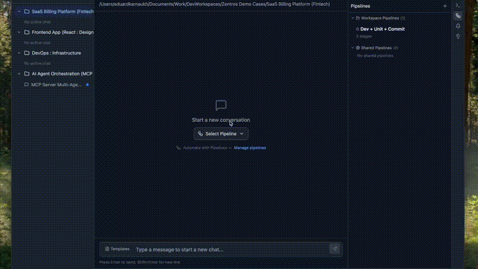

# Zentros

**A modern desktop application for AI-powered software development**

Zentros wraps the Claude Code CLI with an intuitive visual interface, eliminating the need for traditional IDEs. Build, manage, and ship software faster with AI assistance.

## Demo

### Matrix Mode


### Pipelines


## Features

- **Workspaces** - Organize and manage multiple projects with ease
- **Claude Code Integration** - Native integration with Claude Code CLI for AI-powered development
- **Built-in Terminal** - Full terminal emulator for command execution
- **File Explorer** - Browse, view, and edit source code with Monaco Editor
- **Docker Support** - Container management for isolated development environments
- **Git Integration** - Visual git operations, branch management, and diff viewer
- **Matrix Mode** - Run multiple AI agents in parallel for complex tasks
- **Pipelines** - Create and execute custom development workflows
- **Code Map** - Visualize project structure and file dependencies
- **Dark Theme** - Beautiful dark UI designed for long coding sessions

## Platform Support

| Platform | Status |
|----------|--------|
| macOS | Available |
| Windows | Coming Soon |
| Linux (Ubuntu) | Coming Soon |

## System Requirements

- **macOS** 11.0 (Big Sur) or later
- **Architecture**: Intel (x64) or Apple Silicon (arm64)

## Download

Download the latest version from [GitHub Releases](https://github.com/EduardKarnaukh/zentros/releases).

| Platform | Architecture | File |
|----------|--------------|------|
| macOS | Apple Silicon (M1/M2/M3) | `Zentros-arm64.dmg` |
| macOS | Intel | `Zentros.dmg` |

## Installation

1. Download the appropriate DMG file for your Mac
2. Open the DMG file
3. Drag Zentros to your Applications folder
4. Open Zentros from Applications
5. If prompted about security, go to System Preferences > Security & Privacy and click "Open Anyway"

## Prerequisites

Zentros requires **Claude Code CLI** to be installed on your system:

```bash
npm install -g @anthropic-ai/claude-code
```

After installation, authenticate with your Anthropic API key:

```bash
claude login
```

## Quick Start

1. Launch Zentros
2. Click "Open Folder" to select your project directory
3. Start chatting with Claude to build, modify, and debug your code
4. Use the built-in terminal for additional commands

## Tech Stack

- **Frontend**: React 18, TypeScript, Tailwind CSS
- **Desktop**: Electron
- **Editor**: Monaco Editor
- **Terminal**: xterm.js
- **Database**: SQLite (better-sqlite3)

## Keyboard Shortcuts

| Action | Shortcut |
|--------|----------|
| New Chat | `Cmd + N` |
| Toggle Terminal | `Cmd + T` |
| Toggle File Explorer | `Cmd + E` |
| Focus Input | `Cmd + L` |

## License

MIT License - see [LICENSE](./LICENSE) for details.

## Support

- Report issues on [GitHub Issues](https://github.com/EduardKarnaukh/zentros/issues)
- Read the documentation in the app's Help menu

## Changelog

See [CHANGELOG.md](./CHANGELOG.md) for version history.
